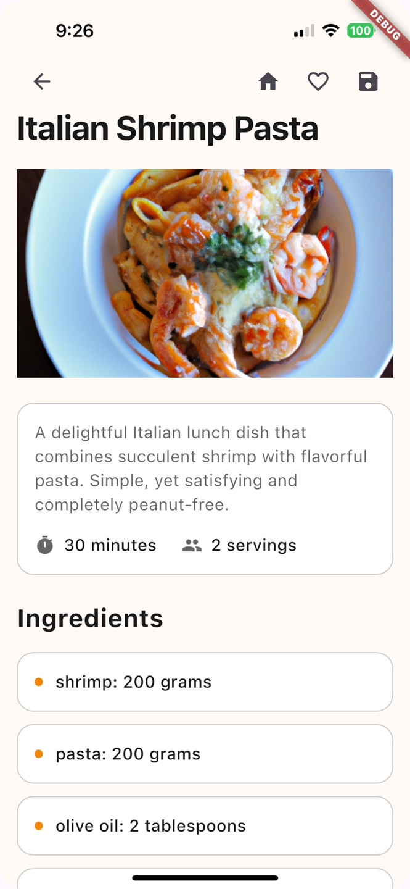
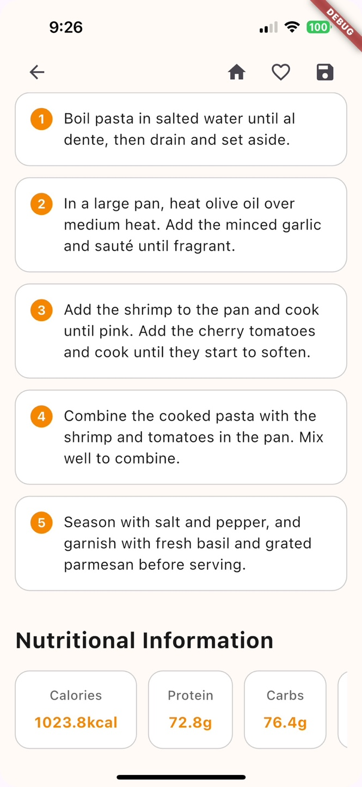

# 🍳 MakeEat - AI-Powered Recipe Generator

<div align="center">
  <p><em>Transform your ingredients into delicious meals with AI-powered recipe generation</em></p>
</div>

## ✨ Key Features

- 🤖 **Smart Recipe Generation**: Leverages OpenAI's GPT for personalized recipe creation based on available ingredients
- 📸 **Receipt Scanner**: Advanced OCR technology to extract ingredients from grocery receipts
- 🎨 **Intuitive UI**: Custom-designed gradient interfaces with DM Sans typography
- 🔄 **Real-time Updates**: Seamless Firebase integration for instant recipe synchronization
- 📱 **Cross-platform**: Built with Flutter for both iOS and Android compatibility
- 💾 **Offline Support**: Local storage implementation for favorite recipes

## 🛠️ Technical Stack

### Frontend
- **Framework**: Flutter 3.0+ with Dart
- **State Management**: Provider 6.1.2
- **UI Components**: Custom widgets with Material Design
- **Image Processing**: Image Gallery Saver & Permission Handler

### Backend & Services
- **Authentication**: Firebase Auth 5.3.3
- **Database**: Cloud Firestore 5.5.0
- **API Integration**: OpenAI for recipe generation
- **Storage**: SharedPreferences & Path Provider
- **Analytics**: Firebase Core 3.8.0

## 📱 Screenshots & Demo

<div align="center">
  <table>
    <tr>
      <td></td>
      <td></td>
    </tr>
  </table>
  
  <h4>App Demo</h4>
  <a href="assets/screenshots/screenrecord.mp4">Watch Demo Video</a>
</div>

## 🚀 Getting Started

1. **Clone the repository**  
   ```bash
   git clone https://github.com/MakeEat/frontend.git
   ```

2. **Install dependencies**
   ```bash
   flutter pub get
   ```

3. **Configure environment variables**
   ```bash
   cp .env.example .env
   ```
   Required variables:
   - OPENAI_API_KEY
   - FIREBASE_CONFIG
   - FATSECRET_API_KEY

4. **Run the app**
   ```bash
   flutter run
   ```

## 🏗️ Project Structure
